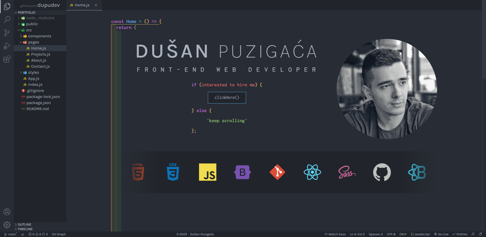

# Portfolio

## About

This is my react portfolio app. My goal was to create application that will look similar to Visual Studio Code. I added basic functionality only.
Sidebar is used as navigation menu. You can navigate by clicking on any page file in pages folder. When clicked, page will open in separate tab, similar as in VSC. Tabs can be rearranged (drag and drop) and closed. Every page has initial typing animation, making it look like react component.

## Libraries and Frameworks

1. React
2. [React-Bootstrap](https://react-bootstrap.github.io)
3. [React-Icons](https://react-icons.github.io/react-icons/)
4. [React-fast-marquee](https://www.npmjs.com/package/react-fast-marquee)
5. [React-intersection-observer](https://www.npmjs.com/package/react-intersection-observer)
6. [Framer-motion](https://www.npmjs.com/package/framer-motion)
